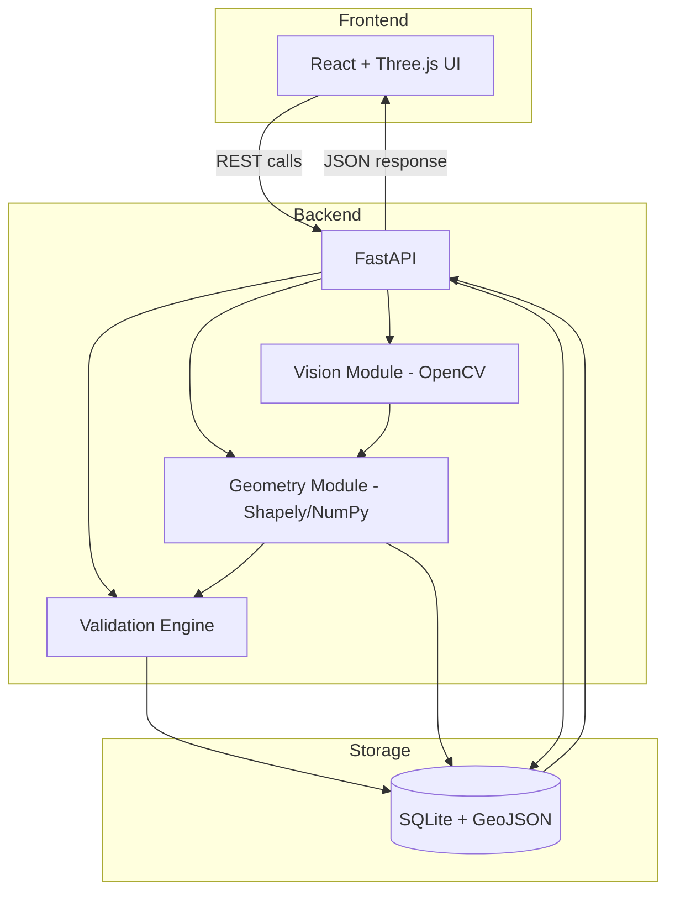
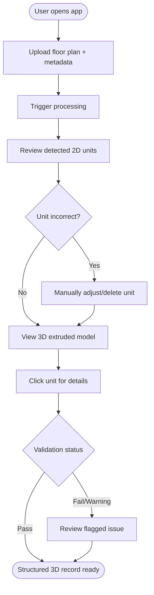
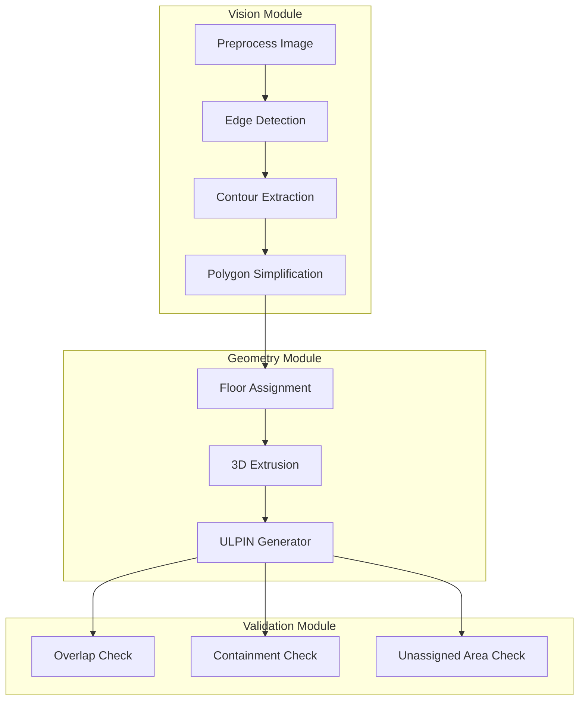
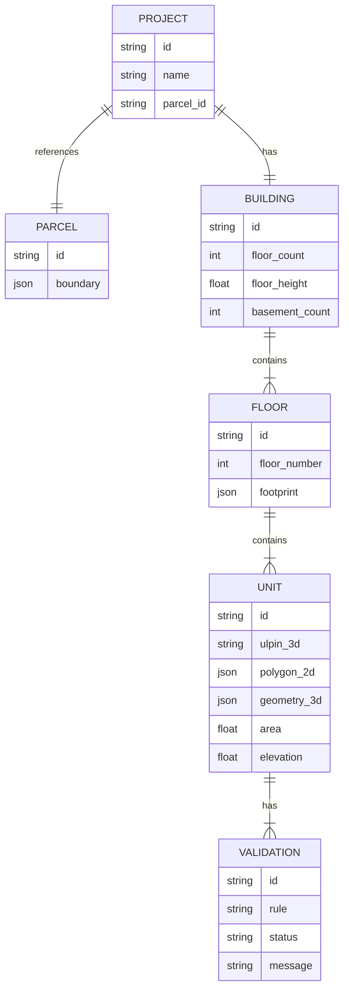
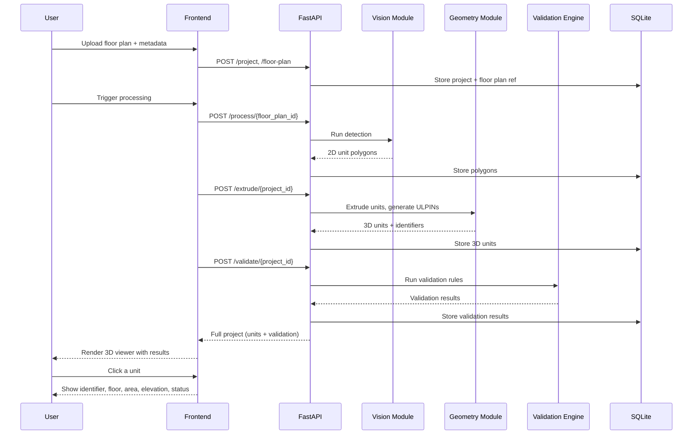

# Product Requirements Document
## Automated 3D Vertical Property Mapping from 2D Building Plans
**24-Hour Independent Hackathon | Theme: Urban Planning | Team size: 3**

**Document status:** Implementation-ready draft
**Team:** [Team Name]
**Last updated:** [Date]

---

## 1. Executive Summary

This document specifies a 24-hour hackathon MVP that converts a 2D building floor plan into a validated, uniquely-identified 3D representation of the individual property units inside that building. The system detects rooms/units on a floor plan using computer-vision-assisted processing, extrudes them into 3D volumes using floor height and elevation, assigns each unit a unique traceable 3D property identifier linked to its parent 2D land parcel, runs geometric/topological validation, and renders the result in an interactive 3D viewer. The MVP uses representative floor plans and synthetic building metadata — not real survey data — and is architected so real geospatial data sources can be substituted later without redesigning the pipeline.

---

## 2. Problem Definition

Land records today describe property as flat 2D ground parcels. A modern multi-storey building sits on one such parcel but contains dozens of independently owned/identifiable units stacked vertically, plus basement and underground space. A single 2D parcel boundary cannot represent which unit is where in 3D, who "owns" which volume of space, or how underground and above-ground units relate to the same parent parcel. This is a structural gap in how vertical property is represented, not a data-entry problem — the representation itself needs an extra dimension.

---

## 3. Problem Analysis

**Core urban-planning problem:** No structured way exists to decompose a single 2D land parcel into individually identifiable, spatially validated 3D property units.

**Existing limitations:**
- 2D cadastral/parcel records stop at the ground footprint
- No standard identifier scheme links a specific flat/unit/basement space back to its parent parcel
- Manual floor-plan-to-record conversion (where it happens at all) is slow and error-prone
- No automated way to check that units are geometrically valid (no overlaps, no gaps, correctly nested)

**Who experiences the problem:** Municipal/land-record officials, urban planners assessing vertical development, developers who need to register individual units, and downstream systems that need a reliable per-unit identifier.

**Why it matters:** Vertical property disputes, ambiguous ownership boundaries, and inconsistent unit records all trace back to the lack of a validated 3D representation.

**Existing workflows/tools:** Floor plans are produced by architects (CAD/PDF/image) but are not systematically converted into structured, identifier-bearing spatial records; this conversion is largely manual today.

**What the proposed system needs to improve:** Automating floor-plan-to-3D-unit conversion, assigning traceable identifiers, and validating the result geometrically.

**Required inputs (explicit):** 2D building/floor plan (image), basic building metadata (floor count, floor height, elevation reference, parent 2D parcel reference).

**Expected outputs (explicit):** Per-unit 2D polygons, per-unit 3D volumes, per-unit 3D ULPIN-style identifiers, validation results, interactive 3D visualization.

**Where AI is genuinely useful:** Detecting room/unit boundaries on a floor-plan image — this is a visual pattern-recognition task poorly suited to purely manual or purely rule-based extraction.

**Where GIS/geospatial processing is required:** Polygon representation of units, area calculation, containment/overlap checks, coordinate handling for extrusion.

**Where 3D visualization adds value:** It is the only way to intuitively demonstrate that a 2D parcel now maps to a stack of individually identifiable volumes — this is the core "aha" of the whole concept.

**Feasible within 24 hours:** A single representative building, one or two floor plans, a pragmatic (not state-of-the-art) segmentation approach, simplified extrusion, rule-based validation, and a web-based 3D viewer. Not feasible: multi-building batch processing, real CAD/DXF parsing, or a fully general-purpose floor-plan parser.

### Explicit requirements (from the PS)
- Accept 2D floor plan + basic building metadata as input
- Automatic/AI-assisted room/unit extraction from the floor plan
- Generate 2D unit polygons associated with their floor
- Extrude units into 3D volumes using floor height/elevation
- Generate a unique 3D ULPIN-style identifier per unit, linked to parent 2D parcel
- Represent basement/underground space with negative elevation
- Geometric/topological validation: overlap, containment, duplicate, unassigned-area detection
- Interactive 3D visualization: select a unit, view identifier, floor, area, elevation, validation status
- Use representative floor plans + synthetic metadata, not real LiDAR/drone/GNSS/cadastral data
- Architecture must be extensible to real geospatial data sources later

### Reasonable assumptions (not explicit, required to build)
- One representative building is sufficient for the MVP demo; a second building is a stretch goal, not a requirement
- Floor plans will be reasonably clean, rectilinear-ish raster images (scanned/exported, not hand-sketched) to keep detection tractable in 24 hours
- "Parent 2D parcel" can be a simple mock record (ID + boundary polygon) created for the demo, not sourced from any real registry
- A single coordinate system (local/arbitrary, e.g., building-relative meters) is sufficient — real-world geographic projection is not required
- "Elevation" per floor is derived arithmetically from floor number × floor height, not from real survey elevation data

### Proposed enhancements (nice-to-have, not essential)
- Second sample building to show pipeline reusability
- CSV/GeoJSON export of generated units and identifiers
- Search-by-identifier in the 3D viewer

---

## 4. Target Users

| Persona | Problem | Need | System interaction | Benefit |
|---|---|---|---|---|
| Municipal land-record / urban-planning official | No structured 3D record of vertical property | Understand how a building's units map spatially and legally to the parent parcel | Views the 3D model, inspects unit identifiers and validation status | Faster, more reliable vertical-property record-keeping |
| Urban planner / GIS analyst | Cannot assess vertical density/space use from 2D data alone | Visualize how floor space is distributed and validated across a building | Uses layer toggles, floor filters, validation panel | Better spatial understanding of vertical development |
| Developer / property registrant (illustrative) | No standard way to register individual units against a parcel | Wants each unit to have one clear, traceable ID | Would eventually submit floor plans through this pipeline | Reduced ambiguity in unit-level registration |

*(Surveyor/infrastructure-planner personas are omitted — the PS does not involve field survey or infrastructure-conflict inputs.)*

---

## 5. Product Vision

**One-sentence product statement:** A prototype that converts a building's 2D floor plan into a validated 3D map of its individual property units, each carrying a unique identifier traceable to its parent land parcel — for municipal land-record officials and urban planners who currently have no structured way to represent vertical property.

**Current problem:** Vertical property (flats, basements, underground space) has no structured 3D representation linked to the 2D parcel it sits on.

**Proposed solution:** An automated pipeline — floor plan in, validated 3D identified units out — with an interactive viewer.

**Why it matters for urban planning:** Vertical development is now the dominant form of urban growth in dense cities; planning and land-record systems built only for flat ground parcels cannot keep up.

**Key differentiator:** The pipeline produces a *validated, traceable identifier* per unit — not just a pretty 3D model — with explicit geometric checks a planner could actually rely on.

**Expected impact (for the prototype):** Demonstrates, on a real floor plan, that automated 2D-to-3D unit conversion with identifier generation and validation is technically achievable — establishing the foundation for a future production cadastral tool.

---

## 6. Goals

- G1: End-to-end pipeline: floor plan → detected units → 3D volumes → identifiers → validation → 3D viewer, running live
- G2: Every generated unit has a unique, traceable 3D identifier linked to a mock parent parcel
- G3: At least one class of geometric error (overlap, gap, or containment failure) is demonstrably detected by the validation engine
- G4: Interactive 3D viewer where any unit can be selected to show its identifier, floor, area, elevation, and validation status
- G5: Clear, honest framing that inputs are representative/synthetic, with an explicit extensibility story for real data

## 7. Non-Goals

- Real CAD/DXF/BIM file parsing
- Real drone, LiDAR, GNSS/CORS, or cadastral data ingestion
- Multi-building, city-scale, or batch processing
- Legal/registry integration
- Full-featured polygon editor (only lightweight correction, see §8)
- Authentication, multi-tenancy, production security
- Handling arbitrary/non-rectilinear architectural styles robustly

---

## 8. Assumptions

(Consolidated from §3 for quick reference)
- One primary demo building; second is stretch-only
- Floor plans are reasonably clean raster images
- Parent parcel is a mock record created for the demo
- Local/arbitrary coordinate system, not real-world geographic projection
- Elevation is computed arithmetically, not survey-derived

---

## 9. MVP Scope — Reframed for 24 Hours

**Guiding principle applied:** one clean pipeline run — floor plan → 3D validated units → viewer — beats a longer feature list with a shaky end-to-end path.

**Minimum viable version:** Process one building (ground + 1–2 upper floors + one basement level) through the full pipeline, generate identifiers, run 3–4 validation rules, and display everything in a working 3D viewer with click-to-inspect.

---

## 10. P0 / P1 / P2 Features

### P0 — Must Have
1. Upload/select a 2D floor plan image + enter building metadata (floor count, floor height, elevation base)
2. AI-assisted unit/room detection on the floor plan → 2D unit polygons
3. Floor assignment of detected units
4. 3D extrusion of units using floor height/elevation (including negative elevation for basement)
5. 3D ULPIN-style identifier generation per unit, linked to a mock parent 2D parcel
6. Validation engine: overlap detection, containment check (unit within floor footprint), unassigned-area detection
7. Interactive 3D viewer: rotate/zoom, click a unit, see its identifier/floor/area/elevation/validation status
8. One fully working end-to-end demo run on the primary sample building

### P1 — Should Have
9. Lightweight manual correction of a misdetected unit polygon (adjust/delete, not full CAD editing)
10. Duplicate-unit detection in validation
11. Floor/level visibility toggle (isolate one floor at a time)
12. Basement layer toggle (show/hide underground independently)

### P2 — Future Scope (explicitly NOT built now)
13. Real CAD/DXF/point-cloud ingestion
14. Multi-building batch processing
15. Full polygon editor with snapping/undo history
16. Integration with a real land-registry/cadastral database
17. Multi-user collaboration, auth, audit trail
18. Automated floor-plan quality scoring / auto-rejection

---

## 11. User Stories

- As a **land-record official**, I want to upload a floor plan and get back a set of identified 3D units, so that I can see a structured vertical-property record instead of a flat parcel.
- As a **GIS analyst**, I want each unit to show its area and floor, so that I can assess space usage per level.
- As an **urban planner**, I want to see basement/underground units represented separately with negative elevation, so that I understand full vertical land use, not just above-ground.
- As a **user**, I want the system to flag overlapping or unassigned-area units, so that I can trust the generated 3D record is geometrically sound.
- As a **user**, I want to click any unit in the 3D view and see its unique identifier and validation status, so that I can inspect individual records without leaving the visualization.
- As a **user**, I want to correct a wrongly-detected unit boundary, so that a single AI misdetection doesn't invalidate the whole floor.

---

## 12. End-to-End Workflow

```text
INPUT
  2D floor plan image + building metadata (floors, floor height, elevation base, parcel ref)
↓
PROCESSING
  Image preprocessing (normalize, denoise) → per-floor plan alignment
↓
AI/GIS ANALYSIS
  CV-based unit/room boundary detection → 2D unit polygons per floor
↓
SPATIAL MODEL
  Floor assignment → 3D extrusion (polygon × floor height, offset by elevation; negative Z for basement)
  → 3D ULPIN generation per unit, linked to parent 2D parcel
↓
VALIDATION
  Overlap check, containment check, unassigned-area check, (P1: duplicate check)
  → per-unit/per-floor pass/warning/fail status
↓
VISUALIZATION
  Interactive 3D viewer: full building, floor isolation, basement toggle, click-to-inspect
↓
USER DECISION
  Official/planner reviews the validated unit set; corrects flagged units if needed;
  treats the output as a structured, traceable 3D property record for the building
```

---

## 13. Data Strategy

**Minimum data required:** one representative floor plan set (ground + 1–2 upper floors + one basement) and a small metadata record for the building.

| Data | Type | Source |
|---|---|---|
| Floor plan images | **Public sample data** | Freely available representative architectural floor plans (non-proprietary, used for demo purposes only) |
| Building metadata (floor count, floor height, elevation base) | **Synthetic/demo data** | Manually authored for the demo, matched to the chosen floor plans |
| Parent 2D parcel record | **Synthetic/demo data** | A single mock parcel ID + boundary polygon created for the demo — not sourced from any real registry |
| Unit detection output | **Precomputed (fallback) + live (primary)** | Generated live by the CV pipeline during the demo; a precomputed version is kept as a fallback (see §28) |

No real data — drone, LiDAR, GNSS/CORS, or actual cadastral records — is used or implied to be used. The pipeline is explicitly structured so a future version could replace "floor plan image" with "point-cloud-derived floor plan" and "synthetic parcel" with "real cadastral parcel lookup" without changing the core detection → extrusion → identifier → validation → viewer flow.

---

## 14. AI/ML Architecture

**Is AI genuinely necessary here?** Yes, for one specific step: detecting individual room/unit boundaries on a floor-plan image. This is a visual segmentation task not well-suited to purely manual annotation at run-time or to simple deterministic rules, given varying wall thicknesses and room shapes.

**Simplest reliable approach for 24 hours:** Classical computer vision (OpenCV), not a trained deep-learning model:
- Grayscale + binarize the floor plan
- Detect wall lines via edge detection/morphological operations
- Find enclosed regions (connected components / contour detection) as candidate room polygons
- Filter by minimum area to discard noise
- Simplify each contour into a clean polygon (Shapely `simplify`)

This is preferred over a trained segmentation model because: no labeled training data exists for these specific plans, training/fine-tuning within the time budget is high-risk, and classical CV on clean architectural line drawings is a well-understood, reliable technique for this exact task.

| Aspect | Detail |
|---|---|
| Input | Preprocessed floor plan image (per floor) |
| Processing | Edge detection → contour/connected-component extraction → polygon simplification |
| Model | None (classical CV, OpenCV) — **not** a trained neural network |
| Output | List of 2D unit polygons (vertex coordinates) per floor |
| Why this approach | Reliable on clean line-drawing floor plans without training data; fully explainable to judges |
| Expected accuracy | Good on clean, high-contrast plans with clear wall lines; degrades on hand-sketched or low-resolution scans |
| Failure cases | Broken/faint wall lines causing merged rooms; furniture/text misread as boundaries; curved walls poorly approximated |
| Fallback | Pre-selected floor plan known to work well, kept as the primary demo asset; manual polygon correction UI (P1) for live fixes |

If time allows and detection quality on the chosen sample plan is poor, a lightweight pretrained segmentation model (e.g., a generic instance-segmentation model) can be tried as a P1 stretch — but classical CV is the committed P0 approach.

---

## 15. Human-in-the-Loop

Full CAD-style editing is out of scope for 24 hours. Lightweight alternative (P1):
- Click a flagged/incorrect unit polygon
- Delete it, or drag its existing vertices to adjust the boundary
- Re-run validation for just that floor (not the whole building) to keep correction fast
- No add-new-vertex/freeform-draw tool in the MVP — correction is limited to adjust/delete of AI-detected polygons

---

## 16. Geospatial Architecture

**Coordinate system:** Local, arbitrary Cartesian coordinate system (pixel-to-meter scale derived from a known reference dimension entered with the building metadata). No real-world geographic projection (e.g., UTM/WGS84) is used in the MVP — the PS explicitly does not require GNSS/CORS input.

**Elevation (Z axis):** Computed as `floor_number × floor_height` relative to a defined ground elevation of 0; basement levels use negative multiples of floor height.

**Tools:** Shapely (polygon geometry, area, overlap, containment), GeoPandas (organizing per-floor unit collections), NumPy (extrusion math). Rasterio/pyproj/PostGIS are not needed — there is no raster geospatial data or real-world CRS involved.

**Operations used:**
- Polygon simplification (from raw CV contours)
- Area calculation per unit
- Intersection (overlap detection between units on the same floor)
- Containment (unit polygon must lie within its floor's footprint boundary)
- Simple 2.5D extrusion (2D polygon + floor height → 3D volume, i.e., prism generation) for the 3D model
- Basic distance/gap estimation (floor footprint area minus sum of unit areas) for unassigned-area detection

Buffering and complex overlay operations are not required by this problem and are excluded to avoid over-engineering.

---

## 17. Validation Engine

| Rule | Input | Logic | Output | Message (example) | Type |
|---|---|---|---|---|---|
| Overlap detection | All unit polygons on a floor | Pairwise polygon intersection test (Shapely `intersects`/`intersection area > 0`) | List of overlapping unit pairs | "Unit F2-U03 overlaps Unit F2-U04 by 4.2 m²" | Hard constraint |
| Containment check | Unit polygon + floor footprint | Unit polygon must be fully within floor footprint (`within`) | Pass/fail per unit | "Unit F1-U02 extends outside the floor footprint" | Hard constraint |
| Unassigned-area detection | Sum of unit areas vs. floor footprint area | Flag if unassigned area exceeds a defined tolerance (e.g., >15% of floor area) | Warning with unassigned area value | "Floor 2 has 22% unassigned area — possible missed unit" | Warning/advisory |
| Duplicate detection (P1) | All unit polygons on a floor | Near-identical polygon geometry test | Flag duplicate pair | "Unit F1-U05 appears to duplicate F1-U06" | Warning/advisory |

Hard constraints block a unit from receiving a "validated" status; warnings are surfaced but do not block identifier generation, since the goal is to demonstrate detection, not silently discard imperfect results.

---

## 18. 3D Architecture

Relevant components for this PS (only these — no development-envelope or future-vertical-development modeling, since the PS doesn't call for it):
- Ground parcel (mock 2D boundary, rendered as a reference plane)
- Building footprint
- Floors (each a horizontal slab at its computed elevation)
- Individual units (extruded 3D volumes per floor)
- Basement/underground units (negative-elevation volumes)

Each unit is a simple extruded prism (2D polygon × height) — not a fully modeled architectural object (no walls, windows, doors). This keeps 3D generation fast and reliable within the time budget while still being spatially accurate.

---

## 19. Frontend Architecture

**Design intent:** professional GIS/planning-tool aesthetic — clear hierarchy, functional panels, no decorative AI styling.

```text
┌──────────────────────────────────────────────────────┐
│ Project | Upload Plan | Building Metadata | Export    │
├──────────────┬───────────────────────────┬───────────┤
│ Layer Panel  │                           │ Unit Info │
│ - Ground     │        3D VIEWPORT        │ Panel     │
│ - Floor 1    │   (rotate / zoom / pan)   │ - ID      │
│ - Floor 2    │                           │ - Floor   │
│ - Basement   │                           │ - Area    │
│              │                           │ - Elev.   │
│ Validation   │                           │ - Status  │
│ Controls     │                           │           │
├──────────────┴───────────────────────────┴───────────┤
│ Validation Summary: 12 units | 1 overlap | 1 warning  │
└──────────────────────────────────────────────────────┘
```

- Layer panel: toggle floors and basement independently
- 3D viewport: primary interaction surface, click-to-select a unit
- Unit info panel: populated on selection with identifier, floor, area, elevation, validation status
- Bottom status bar: running validation summary counts, always visible

---

## 20. 3D Viewer

**Stack:** React + TypeScript + Three.js (via React Three Fiber).

- **Camera controls:** Orbit controls (rotate/pan/zoom), reset-view button
- **Object selection:** Raycasting on click → highlight selected unit (outline/color change), populate info panel
- **Layer visibility:** Per-floor and basement toggles hide/show corresponding mesh groups
- **Highlighting:** Selected unit highlighted; validation-failed units rendered in a distinct warning color by default
- **Metadata inspection:** Info panel bound to selected unit's identifier/floor/area/elevation/validation status
- **Floor/level controls:** Isolate a single floor (hide all others) for a clearer per-floor view
- **Search (P1):** Enter a unit identifier, camera focuses and highlights that unit

No advanced rendering effects (shadows, materials beyond flat/basic shading, animations) — kept intentionally simple for reliability and build speed.

---

## 21. Backend Architecture

**Stack:** Python, FastAPI, Pydantic. No microservices — a single service is sufficient at this scale.

```text
┌─────────────────────────────────────────────┐
│                 FastAPI app                  │
│                                               │
│  /process  → CV pipeline → polygons          │
│  /extrude  → 2D→3D extrusion + ULPIN gen     │
│  /validate → validation engine               │
│  /project  → project/unit retrieval          │
│                                               │
│  Core modules:                               │
│   - vision/  (detection)                     │
│   - geometry/ (extrusion, ULPIN, validation) │
│   - storage/  (SQLite/GeoJSON persistence)   │
└─────────────────────────────────────────────┘
```

**Processing pipeline:** floor plan upload → CV detection module → geometry module (floor assignment, extrusion, identifier generation) → validation module → persisted result → served to frontend via REST.

---

## 22. API Specification

| Method | Path | Purpose | Request | Response | Errors |
|---|---|---|---|---|---|
| POST | `/project` | Create a new project (building + metadata) | `{name, floor_count, floor_height, basement_count, parcel_id}` | `{project_id}` | 400 invalid metadata |
| POST | `/project/{id}/floor-plan` | Upload a floor plan image for a given floor | image file + `{floor_number}` | `{floor_plan_id}` | 400 unsupported format |
| POST | `/process/{floor_plan_id}` | Run unit detection on an uploaded floor plan | — | `{units: [polygon,...]}` | 422 detection failed |
| POST | `/extrude/{project_id}` | Extrude all floors' units into 3D + generate 3D ULPINs | — | `{units_3d: [{id, geometry, elevation},...]}` | 409 missing floors |
| POST | `/validate/{project_id}` | Run validation engine on generated units | — | `{results: [{unit_id, status, message},...]}` | 404 project not found |
| GET | `/project/{id}` | Retrieve full project (floors, units, validation) | — | Full project JSON | 404 not found |
| GET | `/units/{unit_id}` | Retrieve a single unit's detail | — | `{id, floor, area, elevation, status}` | 404 not found |
| PATCH | `/units/{unit_id}` | Manually correct a unit polygon (P1) | `{geometry}` | Updated unit | 400 invalid geometry |

All endpoints return standard HTTP error codes with a short JSON `{"error": "..."}` body; no custom error-code scheme is needed at this scale.

---

## 23. Data Model

| Entity | Field | Type | Required | Description | Relationship |
|---|---|---|---|---|---|
| **Project** | id | UUID | Yes | Project identifier | — |
| | name | string | Yes | Project/building name | — |
| | parcel_id | string | Yes | Mock parent 2D parcel reference | 1:1 Parcel |
| **Parcel** | id | string | Yes | Mock 2D parcel identifier | 1:N Project |
| | boundary | GeoJSON polygon | Yes | Ground parcel boundary | — |
| **Building** | id | UUID | Yes | Building identifier | 1:1 Project |
| | floor_count | int | Yes | Number of above-ground floors | — |
| | floor_height | float | Yes | Height per floor (m) | — |
| | basement_count | int | No | Number of basement levels | — |
| **Floor** | id | UUID | Yes | Floor identifier | N:1 Building |
| | floor_number | int | Yes | Floor index (negative = basement) | — |
| | footprint | GeoJSON polygon | Yes | Floor footprint boundary | — |
| **Unit** | id | UUID | Yes | Internal unit identifier | N:1 Floor |
| | ulpin_3d | string | Yes | Generated 3D ULPIN-style ID | — |
| | polygon_2d | GeoJSON polygon | Yes | Detected 2D unit boundary | — |
| | geometry_3d | 3D mesh data | Yes | Extruded 3D volume | — |
| | area | float | Yes | Unit floor area (m²) | — |
| | elevation | float | Yes | Base elevation (m) | — |
| **Validation** | id | UUID | Yes | Validation run identifier | N:1 Unit |
| | rule | string | Yes | Rule name (overlap/containment/etc.) | — |
| | status | enum(pass/warning/fail) | Yes | Validation outcome | — |
| | message | string | No | Human-readable explanation | — |

---

## 24. Database Design

**Choice: SQLite + GeoJSON columns (stored as text/JSON).**

Reasoning: The MVP has a handful of entities and low data volume (one building, tens of units). PostGIS would add setup/deployment overhead with no meaningful benefit at this scale — spatial queries needed (overlap, containment) are handled in-application via Shapely, not via database spatial functions. SQLite requires no server setup, which reduces risk on hackathon demo-day infrastructure. If the project scaled to multi-building/production use, PostGIS would be the natural upgrade path (see §29).

---

## 25. Technical Stack

| Layer | Technology | Why |
|---|---|---|
| Frontend | React + TypeScript | Fast to build a structured UI with typed component props; team familiarity assumed |
| 3D | Three.js / React Three Fiber | Mature, well-documented web 3D rendering; integrates cleanly with React |
| Backend | Python + FastAPI + Pydantic | Fast to stand up typed REST APIs; Pydantic gives free request validation |
| AI/ML | OpenCV (classical CV) | Reliable on clean floor-plan line drawings without needing training data (see §14) |
| GIS/Geometry | Shapely, GeoPandas, NumPy | Standard, lightweight Python geometry stack; no heavyweight GIS server needed |
| Database | SQLite (+ GeoJSON as text) | Zero-setup, sufficient for MVP data volume (see §24) |
| Deployment | Local/localhost demo (optionally a single cloud VM) | No production deployment requirement for a 24-hour hackathon demo |
| Dev tools | Git, GitHub, Postman/Thunder Client for API testing | Standard, low-overhead tooling |

---

## 26. Team Distribution (3 people, 24 hours)

### PERSON 1 — AI / Data / Analysis
**Responsibilities:** Floor plan preprocessing, CV-based unit detection, polygon simplification, sample data preparation.
**Tech:** Python, OpenCV, Shapely.
**Deliverables:** `/vision` module producing clean 2D unit polygons per floor; curated sample floor plans + metadata.
- Hour 0–4: Select/prepare sample floor plans; set up OpenCV pipeline skeleton
- Hour 4–8: Implement edge detection + contour extraction; test on sample plan
- Hour 8–12: Polygon simplification/filtering; hand off polygon format to Person 2
- Hour 12–18: Tune detection on all floors; prepare precomputed fallback detection results
- Hour 18–22: Support integration testing; fix detection edge cases found during integration
- Final 2h: Support demo rehearsal; own the "how detection works" explanation for judges

### PERSON 2 — Backend / GIS / Core Logic
**Responsibilities:** FastAPI service, geometry/extrusion pipeline, ULPIN generation, validation engine, data model/storage.
**Tech:** Python, FastAPI, Pydantic, Shapely, GeoPandas, SQLite.
**Deliverables:** Working API (§22), extrusion + ULPIN generation module, validation engine (§17).
- Hour 0–4: Scaffold FastAPI project, data model (§23), SQLite schema
- Hour 4–8: Implement `/project` and `/floor-plan` endpoints; storage layer
- Hour 8–12: Implement extrusion logic + 3D ULPIN generation; integrate Person 1's polygon output
- Hour 12–18: Implement validation engine (overlap/containment/unassigned-area); `/validate` endpoint
- Hour 18–22: Integration with frontend; fix API/data-shape issues
- Final 2h: Support demo rehearsal; own backend/architecture questions for judges

### PERSON 3 — Frontend / 3D / UX
**Responsibilities:** React app shell, 3D viewer, layer/validation panels, unit info panel.
**Tech:** React, TypeScript, Three.js/React Three Fiber.
**Deliverables:** Working UI per §19–20, wired to backend API.
- Hour 0–4: Scaffold React app, layout shell (§19), routing
- Hour 4–8: Build 3D viewport with placeholder geometry; camera controls
- Hour 8–12: Layer panel (floor/basement toggles); wire to mock data
- Hour 12–18: Unit selection + info panel; validation status coloring
- Hour 18–22: Integrate with live backend API; replace mock data
- Final 2h: Polish, demo rehearsal, own frontend/UX questions for judges

**Cross-cutting (shared, not assigned to a single person to avoid bottlenecking core dev):**
- Documentation (README, PRD upkeep): Person 2 drafts, all review, last 2 hours
- Slide deck: Person 3 leads, built in parallel during hours 18–22 using screenshots from the working build
- Testing: each person tests their own module continuously; joint integration testing hours 18–22
- Demo/pitching: all three participate; Person 1 explains AI, Person 2 explains architecture/validation, Person 3 drives the live demo

---

## 27. 24-Hour Execution Plan

| Phase | Task | Owner(s) | Dependency | Deliverable | Definition of Done |
|---|---|---|---|---|---|
| Hour 0–2 | Project setup, repo scaffold, sample data selection | All | — | Repo structure live, sample floor plans chosen | Repo pushed, plans committed |
| Hour 2–4 | Data model + API skeleton; CV pipeline skeleton; frontend shell | P2, P1, P3 | Hour 0–2 | Empty-but-running API, blank 3D viewport | Each piece runs locally, no integration yet |
| Hour 4–8 | Unit detection working on 1 floor; core API endpoints; 3D viewport renders static geometry | P1, P2, P3 | — | Detected polygons for 1 floor; `/project`/`/floor-plan` live; viewport renders a mock cube stack | Detection output visually correct on 1 floor |
| Hour 8–12 | Detection across all floors; extrusion + ULPIN generation; layer panel wired to mock data | P1, P2, P3 | Hour 4–8 | All floors detected; `/extrude` returns 3D units with IDs; layer toggles work on mock data | Full mock pipeline runs end-to-end with placeholder data |
| Hour 12–16 | Validation engine implemented; unit selection + info panel; precomputed fallback prepared | P2, P1, P3 | Hour 8–12 | `/validate` returns real results; clicking a unit shows metadata | At least overlap + containment rules working |
| Hour 16–20 | Full integration: live detection → extrusion → validation → viewer | All | Hour 12–16 | End-to-end pipeline runs live on primary sample building | One complete live run succeeds without manual patching |
| Hour 20–22 | Bug fixing, demo reliability pass, precomputed fallback verified | All | Hour 16–20 | Stable demo build | Demo run repeated successfully 2+ times in a row |
| Hour 22–24 | Final polish, slide deck finalized, rehearsal, judge Q&A prep | All | Hour 20–22 | Demo-ready build + deck | Full run-through completed on time |

**Priority order maintained throughout:** working core pipeline > integration > demo reliability > UI polish > optional (P1/P2) features.

---

## 28. Fallback Strategy

| Component | If it fails | Fallback |
|---|---|---|
| AI detection | Detection fails/looks bad live | Switch to a precomputed detection result for the primary sample floor plan, generated earlier and stored as static JSON |
| GIS/extrusion | Extrusion or validation logic errors on edge-case geometry | Fall back to simplified/regularized polygons (e.g., convex hull of detected points) to guarantee valid geometry |
| Backend | API/server issue during live demo | Local JSON fixture file loaded directly by the frontend, bypassing the API for that portion of the demo |
| 3D viewer | Three.js rendering issue | Simplified 2D floor-by-floor plan view (colored polygons per unit) as a visual fallback |
| Full integration | End-to-end live run fails | Pre-generated, fully end-to-end demo dataset (all stages precomputed) shown instead, clearly narrated as "here's a completed run" |

The demo must remain functional even if one advanced component fails — the fallback chain above ensures a presentable result at every stage.

---

## 29. Live vs. Precomputed

- **Must happen live during demo:** Uploading/selecting the floor plan; the 3D viewer interaction (rotate, select unit, view info panel); at least one validation flag shown live
- **Can be precomputed:** The primary detection run (kept ready as a fallback even if live detection is attempted first); the mock parcel record
- **Can be simulated:** Building metadata (explicitly synthetic, stated as such)
- **Must be genuinely implemented (not faked):** The extrusion math, ULPIN generation logic, and validation rule logic — these are the technical substance of the project and must actually run, even if their input data is precomputed for demo safety

---

## 30. Demo Flow (3–5 minutes)

1. State the problem: "2D land records can't represent stacked vertical property" (15s, one slide/visual)
2. Show a flat 2D parcel boundary — the current representation (15s)
3. Provide input: select the sample floor plan + building metadata (20s)
4. Run detection: show AI-detected unit polygons appearing on the floor plan (30s)
5. Show the GIS result: 2D unit polygons per floor, floor-assigned (20s)
6. Show the 3D spatial model: units extrude into a full 3D building, basement included (30s)
7. Highlight one meaningful insight: e.g., "this building's ground parcel now maps to 14 individually identified 3D units" (20s)
8. Demonstrate validation: point out a flagged overlap/unassigned-area warning on screen (30s)
9. Demonstrate correction: adjust or acknowledge the flagged unit (if P1 built) (20s)
10. Show the final result: click a unit, show its full identifier/floor/area/elevation/status (30s)
11. Close with the scaling story: "same pipeline, swap floor plans for point-cloud-derived input and mock parcels for real cadastral records" (20s)

Total: ~4 minutes, leaving buffer for Q&A.

---

## 31. Success Metrics

Only metrics genuinely measurable during/after the hackathon:

- **Processing success rate:** % of floors in the demo building successfully processed end-to-end without manual intervention
- **Geometry validity:** % of generated unit polygons that are valid (non-self-intersecting) Shapely geometries
- **Validation coverage:** number of distinct validation rules successfully triggered and correctly demonstrated (at least 1 overlap or containment case shown)
- **Processing time:** wall-clock time from floor-plan input to fully validated 3D model, measured on the demo machine
- **API response time:** measured response time for `/extrude` and `/validate` on the demo dataset
- **Identifier uniqueness:** 100% of generated 3D ULPINs unique within the demo project (directly checkable)

No detection-accuracy percentage is claimed unless it is actually measured against manually-labeled ground truth on the sample floor plan during the hackathon; if not measured, this is reported qualitatively ("visually correct on the primary demo floor plan") rather than with an invented number.

---

## 32. Security and Privacy

**Relevant data categories:** Uploaded floor plan images; building metadata; mock parcel reference. No personal data, no real ownership/location data, no real property records are used.

| Aspect | MVP approach | Production approach (not built now) |
|---|---|---|
| File upload | Accepted locally, no scanning/sanitization beyond format check | Virus/malware scanning, size limits, sanitization |
| Access control | None — single-user local demo | Full authentication, role-based access (official/planner/citizen) |
| Data storage | Local SQLite file, unencrypted | Encrypted at rest, access-audited |
| API security | None (localhost, no auth) | API keys/OAuth, rate limiting, HTTPS |

No enterprise security is implemented in the MVP — this is an explicit, stated scope decision, not an oversight.

---

## 33. Future Production Architecture

```text
Real data sources (drone imagery, LiDAR, GNSS/CORS, cadastral registry)
        ↓
Data ingestion (format adapters replacing "floor plan image" input)
        ↓
Spatial processing (same extrusion/geometry core, extended to real-world CRS)
        ↓
AI analysis (upgraded to trained segmentation model on real building imagery)
        ↓
Spatial database (PostGIS, replacing SQLite)
        ↓
Analytics engine (aggregate vertical-density analysis across many buildings)
        ↓
2D / 3D visualization (same viewer concept, scaled to multi-building city view)
        ↓
Urban planning decisions (vertical development assessment, dispute resolution support)
```

The core detection → extrusion → identifier → validation → visualization pipeline built in this MVP is intended to carry forward unchanged in concept; only the input adapters, model sophistication, and storage layer would need to scale up.

---

## 34. Future Roadmap (beyond this hackathon)

- Replace classical CV detection with a trained segmentation model on real architectural/point-cloud-derived floor plans
- Real cadastral parcel lookup instead of mock parcel records
- Multi-building, city-scale processing with PostGIS
- Full polygon editing tool for human correction
- Integration story with real land-registry systems (not designed here, as no such integration is specified in the PS)

---

## 35. Repository Structure

```text
project/
│
├── frontend/
│   ├── src/
│   │   ├── components/   (LayerPanel, Viewport, InfoPanel, ValidationBar)
│   │   ├── viewer/        (Three.js/R3F scene setup)
│   │   └── api/           (API client)
│
├── backend/
│   ├── app/
│   │   ├── vision/        (CV detection module)
│   │   ├── geometry/      (extrusion, ULPIN generation)
│   │   ├── validation/    (validation engine)
│   │   ├── storage/       (SQLite models, GeoJSON handling)
│   │   └── main.py        (FastAPI app, routes)
│
├── data/
│   ├── sample_floor_plans/
│   └── precomputed_fallback/
│
├── tests/
│
├── docs/
│   ├── PRD.md
│   ├── ARCHITECTURE.md
│   ├── AI_DESIGN.md
│   ├── GIS_DESIGN.md
│   ├── API.md
│   ├── DATASET.md
│   ├── DEMO.md
│   └── JUDGE_QA.md
│
└── README.md
```

---

## 36. Documentation To Create

### Must Have
1. **PRD** (this document) — overall scope and plan
2. **System Architecture** — component diagram, data flow (see §37)
3. **AI/ML Design** — detection approach, failure cases, fallback (expands §14)
4. **GIS/Spatial Logic Specification** — extrusion, validation rule detail (expands §16–17)
5. **API Documentation** — endpoint reference (expands §22)
6. **README** — setup/run instructions for judges/teammates
7. **Demo Script** — the exact spoken/click walkthrough (expands §30)

### Optional
8. **Dataset Documentation** — what sample data was used and why
9. **Test Plan** — expands §38's test table
10. **Judge Q&A** — expands §39
11. **Future Roadmap** — expands §34

---

## 37. Mermaid Architecture Diagrams

### System Architecture


### Data Flow


### User Workflow


### Component Architecture


### Database ER Diagram


### Sequence Diagram — Primary Workflow


---

## 38. Testing Strategy

| Test | Input | Expected result | Priority |
|---|---|---|---|
| Unit: polygon area calculation | Known rectangle polygon | Correct area returned | P0 |
| Unit: ULPIN generation format | Sample floor/unit index | Correctly formatted, unique ID | P0 |
| Geometry: overlap detection | Two intentionally overlapping polygons | Overlap correctly flagged | P0 |
| Geometry: containment check | Unit polygon outside floor footprint | Containment failure correctly flagged | P0 |
| Geometry: extrusion correctness | 2D polygon + known height | 3D volume with correct height/elevation | P0 |
| AI: detection on clean sample plan | Primary demo floor plan | Reasonable unit boundaries produced | P0 |
| AI: detection on noisy plan | Secondary/lower-quality plan | Degrades gracefully, doesn't crash | P1 |
| API: `/process` endpoint | Valid floor plan upload | 200 response with polygon list | P0 |
| API: invalid input | Malformed metadata | 400 error with clear message | P1 |
| Frontend: unit selection | Click on rendered unit | Info panel updates correctly | P0 |
| Frontend: layer toggle | Toggle a floor off | Corresponding units hidden in viewport | P1 |
| Integration: full pipeline | Primary sample building, live run | Complete run from upload to validated 3D viewer | P0 |
| End-to-end: fallback path | Precomputed dataset loaded | Viewer renders correctly from static fixture | P0 |

---

## 39. Judge Q&A (30+ questions, honestly answered)

**Problem relevance**
1. *Why does this problem matter?* Vertical property has no structured 3D representation today; 2D parcels can't capture stacked ownership, which creates ambiguity in dense urban development.
2. *Why are existing tools insufficient?* Cadastral/GIS tools in common use represent ground parcels only; converting a floor plan into validated, identified 3D units is not a standard, automated capability.
3. *Isn't this just a 3D model viewer?* No — the core contribution is the identifier generation and geometric validation layer, not the rendering itself.

**AI**
4. *Why use AI/CV here at all?* To automate boundary detection from a floor-plan image, which is otherwise a slow manual tracing task.
5. *Why classical CV instead of a trained model?* No labeled training data exists for these plans; classical CV is reliable and explainable on clean architectural line drawings within a 24-hour budget.
6. *What's your detection accuracy?* Not formally benchmarked against labeled ground truth in this timeframe; qualitatively correct on the primary demo floor plan, with known failure modes on low-quality scans (see Q7).
7. *What happens when detection is wrong?* It's flagged during validation (unassigned area, overlap) and can be manually corrected via the lightweight editing workflow.
8. *Would this generalize to any floor plan?* Not robustly yet — it's tuned to reasonably clean, high-contrast plans; hand-sketched or highly stylized plans would need more work.

**GIS**
9. *Why GIS/geometry libraries instead of a game engine or CAD tool?* Shapely/GeoPandas are lightweight, purpose-built for exactly the polygon operations needed (area, overlap, containment) without extra engine overhead.
10. *What coordinate system are you using?* A local/arbitrary coordinate system scaled from the floor plan; real-world geographic projection is out of scope for this prototype.
11. *How is elevation calculated?* Arithmetically from floor number × floor height, not from survey data.
12. *Does your model handle non-rectilinear buildings?* Only partially — irregular shapes are a known limitation, not fully solved in this MVP.

**Data**
13. *Is this real data?* No — floor plans are representative public samples, and building/parcel metadata is synthetic; this is stated explicitly, not hidden.
14. *Why not use real cadastral data?* No real dataset was available or required by the problem statement; the prototype demonstrates the pipeline, not data sourcing.
15. *How would real data change the architecture?* Only the input adapter and storage backend would change — the detection→extrusion→identifier→validation core stays the same.
16. *What happens when data changes (e.g., building is renovated)?* Not handled in this MVP — re-running the pipeline on updated inputs would regenerate the model; versioning/history is future scope.

**Validation**
17. *What exactly does your validation catch?* Polygon overlaps, units extending outside their floor footprint, and floors with significant unassigned area.
18. *What does it NOT catch?* Legal/ownership correctness, structural/building-code compliance, or real-world survey accuracy — it's purely geometric.
19. *What's a hard constraint vs. a warning?* Overlap and containment failures are hard constraints (block "validated" status); unassigned-area is a warning (surfaced, not blocking).
20. *How do you handle a false-positive validation flag?* Manual correction workflow allows the user to adjust the offending polygon and re-validate.

**Scalability**
21. *Does this scale to a whole city?* Not as built — this MVP handles one building; multi-building/city-scale would need batch processing and a spatial database (PostGIS), described in §33 as future work, not built now.
22. *What's the performance on a large building (50+ floors)?* Not tested at that scale; extrusion/validation are computationally simple per-unit operations, so this is expected to scale linearly, but this is an expectation, not a measured result.
23. *Would this work in real time for many concurrent users?* No — the MVP is single-user/local; concurrency and production performance are out of scope.

**Real-world deployment**
24. *Could a municipality actually use this today?* No — this is a prototype demonstrating technical feasibility, not a deployable government system; real deployment would need real data integration, security, and legal review.
25. *What's needed to make this production-ready?* Real data ingestion, trained detection models, PostGIS, authentication, and integration with an actual land registry — none of which are built or claimed here.
26. *Who would own/maintain the identifiers generated?* Not addressed by this prototype — that's a governance question outside the scope of a technical MVP.

**Failure cases**
27. *What if the floor plan is illegible?* Detection would fail or produce poor results; the fallback precomputed dataset is used to keep the demo functional.
28. *What if two units are supposed to overlap (e.g., shared stairwell)?* The current validation treats all overlaps as errors; distinguishing intentional shared space from a genuine error is a known simplification, not solved here.

**Privacy/security**
29. *Is any personal or ownership data used?* No — no personal data, real ownership records, or real locations are used.
30. *Is this secure enough for production?* No, and it's not meant to be — MVP security is minimal by design (see §32); production security is explicitly listed as future work.

**Cost/extensibility**
31. *What would this cost to run at scale?* Not estimated — no cost modeling was performed for this prototype.
32. *Why is your MVP architecture considered extensible?* Because the core pipeline stages (detection → extrusion → identifier → validation → visualization) are modular and input-agnostic — each stage's input format is the only thing that changes with better data sources, not the pipeline logic itself.

---

## 40. Definition of Done

The MVP is complete only when the following full journey works, specifically for this problem statement:

- [ ] A 2D floor plan for the primary demo building can be provided as input, along with building metadata
- [ ] The CV pipeline detects unit/room boundaries on at least ground + 1 upper floor + 1 basement level
- [ ] Detected units are correctly assigned to their floor
- [ ] Units are extruded into 3D volumes at correct relative elevations, with basement below zero
- [ ] Every unit receives a unique 3D ULPIN-style identifier traceable to the mock parent parcel
- [ ] Validation engine runs and correctly flags at least one overlap or containment issue and one unassigned-area warning
- [ ] The 3D viewer renders the full building, supports floor/basement toggling, and supports click-to-inspect showing identifier/floor/area/elevation/validation status
- [ ] The full pipeline (upload → detect → extrude → validate → view) completes as one working live run at least twice in a row without manual patching
- [ ] A precomputed fallback dataset is available and tested as a backup demo path
- [ ] The demo narrative clearly and explicitly states which data is real/public-sample/synthetic/precomputed

---

# BUILD ORDER — WHAT TO CODE FIRST

1. Data model + SQLite schema (Project, Parcel, Building, Floor, Unit, Validation)
2. Mock parcel + building metadata for the primary sample building
3. CV detection pipeline on the primary sample floor plan (single floor first)
4. 2D unit polygon output format agreed and handed off between AI and backend workstreams
5. Floor assignment + 3D extrusion logic (single floor first, then extend to all floors)
6. 3D ULPIN identifier generation
7. Validation engine: overlap check first, then containment, then unassigned-area
8. Minimal API endpoints wired to the above (`/project`, `/process`, `/extrude`, `/validate`)
9. 3D viewer rendering static/mock geometry first, then wired to live API data
10. Unit selection + info panel
11. Layer/floor/basement toggles
12. Precomputed fallback dataset generated and tested
13. Full live integration run, repeated until reliable
14. P1 features (manual correction, duplicate detection) only if steps 1–13 are solid with time remaining
15. Polish, demo rehearsal, slide deck, judge Q&A prep

# DO NOT BUILD

- Real CAD/DXF or point-cloud file parsing
- A trained deep-learning segmentation model (classical CV is the committed approach — do not attempt to train a model from scratch mid-hackathon)
- PostGIS or any external database server
- Multi-building or batch-processing support
- A full-featured polygon editor with undo/redo, snapping, or freeform drawing
- User authentication, roles, or multi-tenant access
- Any real government/cadastral system integration
- Geographic (real-world) coordinate projection/reprojection
- Advanced 3D rendering (shadows, textures, materials, animations)
- Automated report generation/PDF export beyond a simple CSV/GeoJSON stretch feature
